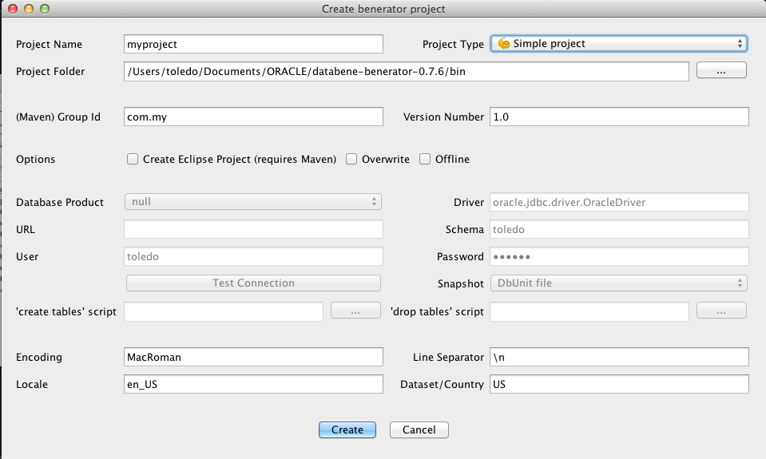
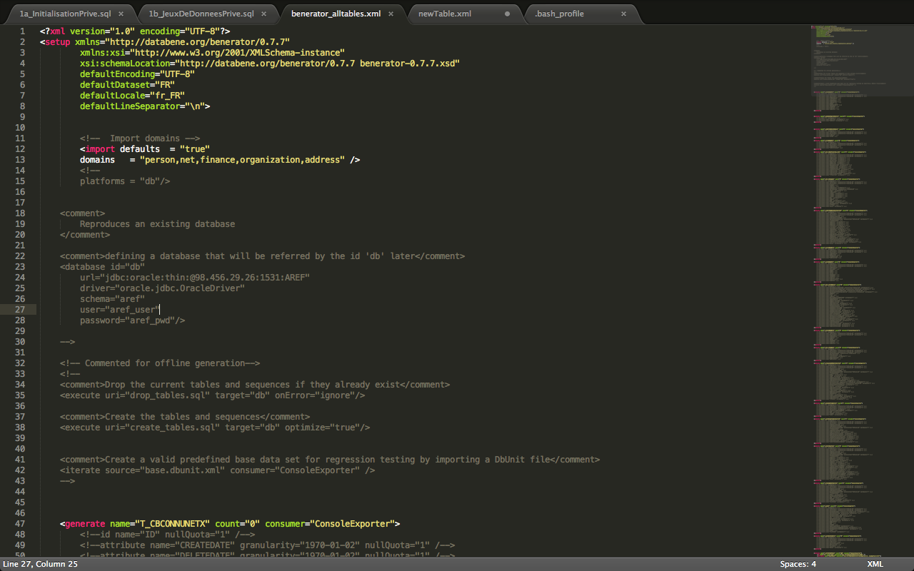

#Avant de commencer
Nous allons supposer que vous voulez installer bénérator sur votre ordinateur et que vous avez la possibilité de vous connecter à une base de données, qu'elle soit distante ou locale.


#Installation
##Téléchargement

1. Allez sur le site [databene](http://databene.org "Site officiel.")
2. Téléchargez l'application en allant dans "benerator => installation" et choisissez [Benerator Distribution](http://databene.org/databene-benerator/112-installing-the-benerator-distribution.html "Version Distribution pour les nouveaux") si vous n'êtes pas encore familier avec l'outil Benerator ou bien téléchargez la version [Maven Plugin](http://databene.org/maven-benerator-plugin "Plug-in Maven") si vous êtes familier avec Maven ET que vous avec besoin d'intégrer des données de génération dans Maven builds. <br/> Ici nous allons utiliser la <strong> version Distribution</strong>

##Configuration

**Ce qui suit est juste une traduction en français des indications données sur le site officiel.**

1. Une fois que vous avez téléchargé Benerator, dézippez le fichier à l'endroit où vous voulez installer l'application. Par exemple:
 > /Applications/benerator
2. Il faut maintenant exporter une variable d'environnement nommée *BENERATOR_HOME* et dont la valeur correspond tout simplement au **chemin absolu du répertoire de l'application**.
	* Sous mac/linux: Ouvrez le fichier *.bash_profile* situé dans le répertoire "/Users/nom_utilisateur" (Attention: c'est un fichier caché). Dedans, tapez le texte ci-dessous (basé sur le précédent exemple):
	> export BENERATOR_HOME = /Applications/benerator/databene-benerator-0.6.0
	* Sous Windows: *Clic droit sur le poste de travail => propriétés => onglet **avancé** => bouton "**variables d'environnement**" => section **Variables utilisateur pour "votre_nom"**; bouton **Nouveau** => Ajoutez le chemin absolu menant à l'application*
3. Nous allons aussi rajouter le chemin des binaires de Benerator:  
	* Sous max/linux: dans le fichier *.bash_profile*, rajoutez la ligne suivante: "export PATH=$PATH:$BENERATOR_HOME/bin"
	* Sous Windows: Retournez dans les variables d'environnement de la même manière que la première fois. Si la variable d'environnement PATH existe, éditez-la pour rajouter "%BENERATOR_HOME%\bin". Si elle n'existe pas, créez-la et mettez la même valeur.

Ça y est, Benerator est installé sur votre ordinateur.

#Utilisation et retours d'expérience.

**Les retours d'expérience constituent une section que vous devez aggrémenter afin de permettre à vos collègues et vous-même de capitaliser votre savoir-faire et de partager vos connaissances acquises. Cela vous facilitera la vie pour de futures utilisations.**  
  
##Utilisation

Benerator est un puissant outil permettant de gonfler la volumétrie de bases de données. Son utilisation n'en est pas pour autant compliquée. Le manuel est disponible [Ici](http://databene.org/download/databene-benerator-manual-0.7.6.pdf "Manuel officiel"). Attention cependant: c'est très rare mais certaines parties contiennent une ou deux fautes. Un manuel, en français celui-ci, mais datant cependant de 2008, est disponible [à cette adresse](http://arodrigues.developpez.com/tutoriels/java/performance/benerator/ "Manuel d'utilisation en français"). Vous trouverez également sur le site officiel quelques [tutoriaux](http://databene.org/databene-benerator/tutorials.html "Tutoriaux") très intéressants pour débuter.

Lorsque vous travaillez avec Benerator, c'est comme si vous faisiez à chaque fois un projet. Vous aurez donc un dossier pour le projet ARPEJ, un dossier pour le projet Achievo, un autre pour le projet Grinder…  
Un projet doit, avant toute chose, être généré. Pour cela, Benerator propose dans son répertoire *bin* un wizard. Pour **Windows** vous devez lancer le *.bat*, pour **Mac/Linux/Unix** vous devez lancer le *.sh*.

**ATTENTION**: ce wizard n'est utile que pour la première utilisation! Par la suite, vous pouvez simplement copier/coller un projet déjà existant et ne changer que certains fichiers. 

La fenêtre suivante s'affiche:

  
*Wizard sous mac*
  
  
**Project Name** concerne le nom du projet  
**Project Folder** est l'emplacement du projet

Sélectionnez, dans **Project Type**, *Reproduce & scale existing database*, configurez les champs, testez la connexion et créez le projet. Allez dans le dossier de votre projet et cherchez le fichier *benerator.xml*. C'est de ce fichier, et uniquement de celui-ci, dont vous aurez besoin par la suite.  
Vous avez donc le droit de supprimer tout le reste et de fermer le wizard. On va maintenant passer à la configuration du fichier *benerator.xml*  

## Connexion à la base de données  
  
Voilà à quoi ressemble le début du fichier *benerator.xml*  
    

Dans la section *&lt;database/>*, vous voyez les identifiants et autres éléments permettant la connexion à la base de données sur laquelle vous voulez travailler.  
**id**="l'id que vous utiliserez pour vous réferrer à la base de données dans le fichier benerator.xml"
**url**="nom du driver:base de données:thin:@ip:port:SID"  
**driver**="nom complet du driver"  
**schema**="nom du schéma"  
**user**="user"  
**password**=""password"  
  
  : Lors de notre première utilisation de benerator, nous devions travailler sur une base de données Oracle, située à distance et dont l'ip changeait à cause d'un cluster. Ainsi, et cela est marqué dans la section **Retours d'expérience**, une erreur peut être levée dans ce contexte, stoppant la génération de données.


## Génération d'une table  
  
Nous allons voir comment générer une table à l'aide d'un exemple tout ce qu'il y a de plus simple. Notre table s'appellera **Table_ID** et sera de plus en plus fournie au fur et à mesure du wiki.

##### Déclarer la table  
Jetez un oeil dans le fichier *benerator.xml* et regardez les tables que benerator a généré. Remarquez pour commencer la balise *&lt;generate>*. Cette balise délimite le bloc d'instructions permettant à benerator de générer les champs de la table selon vos besoin.
Avec la table **Table_ID**, on aurait donc:  
  
```  
<generate name="TABLE_ID" type="TABLE_ID" count="1000000" consumer="db">  
</generate>  
```    
*Vous noterez que l'attribut "consumer" a pour valeur l'id que l'on a donné à notre base de données. Le consumer définit la cible d'écriture des données générée.*

Il va maintenant falloir rajouter des balises pour demander de générer les ID, les attributs ainsi que les clefs étrangères.
##### Les ID
  
Il y a plusieurs manières de configurer la génération d'id. Nous vous conseillons d'utiliser ce qui s'appelle un Generator, et plus précisément un *DBSeqHiLoGenerator* comme il suit:  
  
```  
<generate name="TABLE_ID" type="TABLE_ID" count="1000000" consumer="db">
<id name="ID" generator="new DBSeqHiLoGenerator('SEQ_TABLE_ID',1,db)"/>    
</generate>
```
Ce Generator prend en paramètres le nom d'une séquence, l'incrément, ainsi que la source (donc notre base de données en l'occurence). **La séquence doit déjà exister dans la base de données!**  
Vous pouvez néanmoins utiliser d'autres Generators pour les ID et qui sont explicités dans [le manuel](http://databene.org/download/databene-benerator-manual-0.7.6.pdf "Manuel officiel").

##### Les dates    
  
On veut désormais savoir quand est-ce que notre ID a été généré. Pour cela on va rajouter un champ "DATECREATION" dans la table. Lors de la génération, il faudra définir aussi un Generator pour les dates. Nous vous proposons le code ci-dessous:  
  
 ```  
<generate name="TABLE_ID" type="TABLE_ID" count="1000000" consumer="db">
<id name="ID" generator="new DBSeqHiLoGenerator('SEQ_TABLE_ID',1,db)"/>
<attribute name="DATECREATION" type="date" generator="new BirthDateGenerator(minAgeYears=1,maxAgeYears=10)"/>    
</generate>
```  
Là encore, il existe d'autre Generators décrits dans le manuel.

##### Les champs à NULL  
  
Il peut arriver que vous vouliez mettre des champs à NULL lors de votre génération. La manière de procéder n'est pas la même pour les types d'attributs.  

*Pour une date*:    

```  
<attribut name="DATESUPPRESSION" type="date" nullable="true"/>  
```
  
*Pour un attribut quelconque*:  
  
```    
<attribut name="whatever" type="whatever_too" constant="null"/>    
```  
  
*Pour une clef étrangère*:  
  
```   
<reference name="fk" nullQuota="1"/>  
```  

  
##### Les expressions régulières  
Les expressions régulières sont usitées pour les attributs devant respecter un certain modèle. Ainsi, pour un numéro de téléphone, on aura:    

```
s  
```

##### Les données à partir
##### Les variables
## Gestion des clefs étrangères
## Volumétries importantes
## Retours d'expérience

----------  
Pour les retours d'expérience, je vous propose dans cette première version du wiki Benerator de nous appuyer sur le déroulement d'une partie d'un projet important pour adhoc: le projet **ARPEJ_AREF**.

Lors de ce projet, le client avait une base de données contenant près de 60 tables et avait commencé à migrer les données existentes vers une nouvelle version de la BD. Le problème était que la migration n'avait que partiellement réussie. C'était donc à nous de gonfler la base de données en générant de très grosses quantités d'information.  

Lors de cette phase de génération de nouvelles données, nous avons bien entendu rencontré plusieurs problèmes. Voici les solutions trouvées pour chacun d'entre eux:


* #####  SampleGenerator
Lors de l'exécution du fichier *benerator.xml*, une erreur de type SampleGenerator est levée. Cela signifie que benerator cherche à générer des données pour une table et qu'il manque des informations. Par exemple:
  
ENTREPRISE | ETABLISSEMENT | ADRESSE
---------- | ------------- | -------
id_entreprise | id_etab | id_adr
| #fk_id_entreprise |
| #fk_id_adresse |  
  
Dans ce tableau vous voyez que la table **ETABLISSEMENT** a deux clés étrangères. Hé bien l'exception donc je vous parle sera levée si jamais vous n'avez pas d'adresse ou d'entreprise, ou les deux. Or, si vous n'avez pas d'entreprise, sachez qu'on embauche en ce moment. Prenez donc contact avec notre charmante RH pour proposer votre candidature.  
Vous devez donc toujours vous assurer que vous disposez de l'information nécessaire avant de générer une table.  
  
  
* ##### Contraintes Unique
  * ###### Tables associatives  
Les tables associatives présente un réel problème lorsqu'elles sont soumises à une contrainte de type *Unique*. Nous nous en sommes rendus compte avec le cas suivant:  

ROLE | ROLE_ACTEUR | ACTEUR
---- | ----------- | ------
id_role | #fk_id_role,#fk_id_acteur | id_acteur
  
Pour ces trois tables, **ROLE_ACTEUR** joue le rôle de table associative. Cependant, la combinaison des deux clefs étrangères doit être unique, et lors de la génération, vous ne pouvez pas simplement marquer

```
<generate name="ROLE_ACTEUR" type="ROLE_ACTEUR" count="1000000" consumer="db" pageSize="1000">  
<reference name="fk_id_acteur" source="db" targetType="ACTEUR"/>
<reference name="fk_id_role" source="db" targetType="ROLE"/>
</generate>
```  
Voilà la raison: Benerator va générer pour chacune des clefs une valeur existante, mais il arrivera forcément un moment où vous allez vous retrouver avec une combinaison déjà existante. Pour éviter cela, nous avons eu l'idée de récupérer ces données via un selector. Le code précédent devient:    

```
<generate name="ROLE_ACTEUR" type="ROLE_ACTEUR" count="1000000" consumer="db" pageSize="1000">    
<variable name ="_role_acteur" source="db" selector="SELECT ACTEUR.id_acteur, ROLE.id_role FROM ACTEUR, ROLE WHERE ACTEUR.id_acteur NOT IN (SELECT fk_id_acteur FROM ROLE_ACTEUR WHERE fk_id_role=ROLE.id_role)"/>
<reference name="fk_id_acteur" script="_role_acteur[0]"/>
<reference name="fk_id_role" script="_role_acteur[1]"/>
</generate>
```  
  
*On vérifie pour l'id_acteur qu'il n'est pas combiné avec la clef étrangère fk_id_role*  

Vous savez donc maintenant comment prendre en compte une contrainte Unique pour une table associative, mais seulement lorsque les clefs étrangères proviennent de tables différentes. Alors qu'en est-il pour une table qui, par exemple, est composée de deux clefs étrangères provenant d'une seule et même source?  


ACTEUR | ADMINISRATEUR_GERANT  
------ | --------------------  
id_acteur |#fk_id_acteur_géré,#fk_id_acteur_gérant  
  
Rien de bien compliqué, le code devient:  
  
```
<generate name="ADMINISTRATEUR_GERANT" type="ADMINISTRATEUR_GERANT" count="1000000" consumer="db" pageSize="1000">    
<variable name ="_admin_gerant" source="db" selector="SELECT act1.id, act2.id FROM T_ACTEUR act1, T_ACTEUR act2 WHERE act1.id<>act2.id"/>
<reference name="fk_id_acteur" script="_admin_gerant[0]"/>
<reference name="fk_id_role" script="_admin_gerant[1]"/>
</generate>
```    
  
* ##### Génération de données imbriquées  
Nous nous sommes aperçus, après de multiples tests de génération, que des contraintes uniques nous étaient inconnues jusqu'à présent. Ces contraintes étaient les suivantes:  
  
REFENTREPRISE | REFETABLISSEMENT | ACTEUR
------------- | ---------------- | ------  
unique(siren)| unique(siren,NIC) | unique(nom,prenom,siret)  
  
Le problème était posé par les relations suivantes:  
  
| REFETABLISSEMENT | ACTEUR |
| ---------------- | ------ | 
| #fk_id_refentreprise | #fk_id_refetablissement |
| #fk_id_adresse |  |
  
Il fallait donc premièrement générer les adresses de la table ADRESSE d'une part, mais surtout les entreprises d'autre part. Or, pour chaque entreprise créée, il faut créer un (voire plusieurs) établissement afin de pouvoir obtenir le siren de l'entreprise à laquelle il est rattaché. Mais, de même, il faut aussi créer un ou plusieurs acteurs pour chaque établissement créé, afin de créer son siret de manière unique et conforme au siren + NIC de l'établissement auquel il est rattaché.  
  
Le code que l'on obtenait était:      

```
<generate name="T_REFENTREPRISE" type="T_REFENTREPRISE" count="12000000" consumer="db" pageSize ="1000">
	<id name="id" type="long" generator="new DBSeqHiLoGenerator('SEQ_REFENTREPRISE', 1, db)"/>
	<attribute name="CREATEDATE" type="date" generator="new BirthDateGenerator(minAgeYears=1, 
maxAgeYears=10)"/>
	<attribute name="DELETEDATE" type="date" nullable="true"/>
	<attribute name="CATEGORIEJURIDIQUE" type="string" pattern="[a-zA-Z0-9]{4}" />
	<attribute name="DATECESSATION" type="date" nullable="true"/>
	<attribute name="NBETABSIRENE" type="string" pattern="[0-9]{10}" />
	<attribute name="NICSIEGE" type="string" pattern="[a-zA-Z0-9]{5}"/>
	<attribute name="RAISONSOCIALE" type="string" generator="CompanyNameGenerator" dataset="DE" locale="de_DE"/>
	<attribute name="SIGLE" type="string" pattern="[a-zA-Z]{20}" />
	<attribute name="SIREN" type="string" pattern="[0-9]{14}" distribution="expand" unique="true"/>    
  
  
	<generate name="T_REFETABLISSEMENT" type="T_REFETABLISSEMENT" count="17000000" consumer="db" pageSize="1000">
		<variable name="siren_id_entr" source="db" selector="" distribution="expand"/>
		<variable name="entreprise" type="string" pattern="Entreprise [0-9a-z]{3}"/>
		<id name="id" type="long" generator="new DBSeqHiLoGenerator('SEQ_REFETABLISSEMENT',1,db)"/>
    	<attribute name="CREATEDATE" type="date" generator="new BirthDateGenerator(minAgeYears=1, maxAgeYears=10)"/>
    	<attribute name="DELETEDATE" type="date" nullable="true"/>
    	<attribute name="CODECOMMUNE" type="string" pattern="[0-9]{5}"/>
    	<attribute name="CODENAF" type="string" pattern="[0-9]{3}[A-Z]{1}"/>
    	<attribute name="DATECESSATION" type="date" nullable="true"/>
    	<attribute name="DATECREATION" type="date" nullable="true"/>
    	<attribute name="DATEMODIFICATION" type="date" nullable="true"/>
    	<attribute name="DATETRANSFERT" type="date" nullable="true" />
    	<attribute name="NIC" constant="NULL" />
    	<attribute name="NICOLD" constant="NULL"/>
    	<attribute name="NICTRANSFERT" constant="NULL"/>
    	<attribute name="RAISONSOCIALE" type="string" script="entreprise + siren_id_entr[1] "/>
    	<attribute name="SIREN" script="siren_id_entr[1]"/>
    	<attribute name="SITUATION" type="string" pattern="1"/>
    	<reference name="ADRESSE_COR_FK_ID" source="db" targetType="T_ADRESSE" distribution="expand"/>
    	<reference name="ADRESSE_GEO_FK_ID" source="db" targetType="T_ADRESSE" distribution="expand"/>
    	<reference name="REFENTREPRISE_FK_ID" script="siren_id_entr[0]"/>
	</generate>
</generate>
```     

